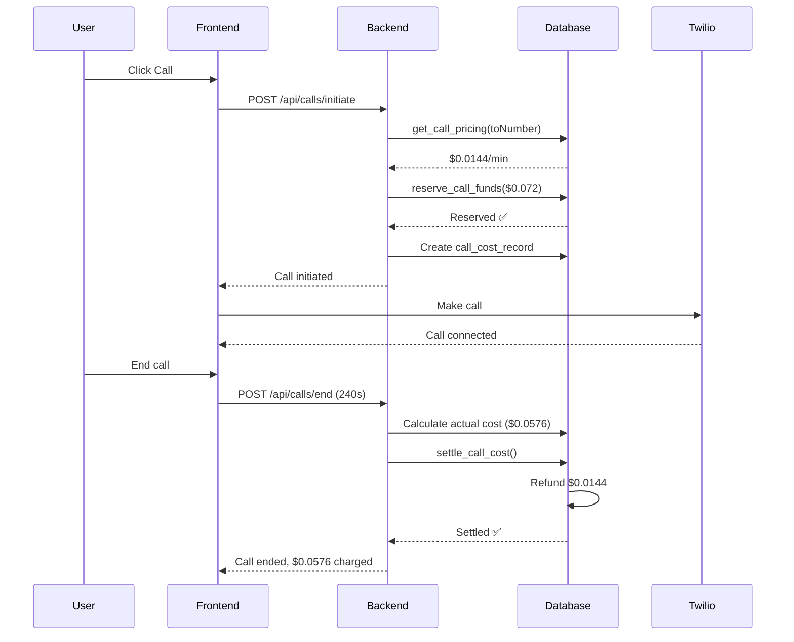

# ✅ PRICING SYSTEM IMPLEMENTATION COMPLETE

## 📦 What Was Built

### 1. **Database Schema** ([supabase/migrations/20260118000000_create_call_pricing_system.sql](supabase/migrations/20260118000000_create_call_pricing_system.sql))

**New Tables:**

- ✅ `call_pricing` - Stores all Twilio pricing data with markup
- ✅ `wallet_transactions` - Tracks reserve/settle/refund transactions
- ✅ `call_cost_records` - Links calls to pricing and transactions

**Database Functions:**

- ✅ `get_call_pricing(destination_number)` - Smart pricing lookup
- ✅ `reserve_call_funds(user_id, org_id, call_sid, amount)` - Pre-reserve funds
- ✅ `settle_call_cost(call_sid, actual_cost)` - Settle and refund

### 2. **CSV Import Script** ([backend/import-pricing-data.js](backend/import-pricing-data.js))

- Parses OutboundVoicePricing.csv (612 records)
- Imports to Supabase with 15% markup
- Deactivates old pricing on re-import
- Includes verification tests

### 3. **Pricing Service** (Added to [backend/server-single.js](backend/server-single.js))

**Functions:**

- `getCallPricing(destinationNumber)` - Get pricing for any number
- `estimateCallCost(destinationNumber, minutes)` - Calculate estimate
- `reserveCallFunds(userId, orgId, callSid, amount)` - Reserve before call
- `settleCallCost(callSid, actualCost)` - Settle after call

### 4. **Updated Call Flow** ([backend/server-single.js](backend/server-single.js))

**Modified Endpoints:**

- ✅ `POST /api/calls/initiate` - Now uses pricing lookup + reserve logic
- ✅ `POST /api/calls/end` - Now uses settle logic with refunds
- ✅ `POST /api/calls/update-sid` - Links temp CallSid to real Twilio CallSid

**New Endpoints:**

- ✅ `GET /api/pricing/estimate` - Get cost estimate before calling
- ✅ `POST /api/pricing/lookup` - Look up pricing for any number
- ✅ `POST /api/pricing/check-balance` - Check if user can afford call

### 5. **Setup & Testing Tools**

- ✅ [setup-pricing.ps1](setup-pricing.ps1) - One-click setup script
- ✅ [backend/test-pricing-system.js](backend/test-pricing-system.js) - Verification tests
- ✅ [PRICING_SYSTEM_SETUP.md](PRICING_SYSTEM_SETUP.md) - Complete documentation

## 🔄 How It Works

### Before (Old System)

```
1. User makes call
2. System estimates cost using rate_settings table
3. Call happens
4. Deduct estimated amount after call ends
❌ Problem: Balance could drop during long calls
❌ Problem: No accurate per-destination pricing
```

### After (New System)

```
1. User initiates call to +14155551234
2. Look up exact Twilio price → $0.0125/min + 15% markup = $0.0144/min
3. Estimate 5 min call = $0.072
4. RESERVE $0.072 from wallet (balance: $10.00 → $9.93)
5. Call happens for 3:45 = 4 billed minutes
6. Actual cost: 4 × $0.0144 = $0.0576
7. SETTLE: Refund $0.072 - $0.0576 = $0.0144
8. Final balance: $9.93 + $0.0144 = $9.97
✅ User charged exact amount
✅ Funds reserved upfront
✅ Automatic refunds
```

## 📊 Transaction Flow



## 🎯 Key Features

### 1. **Accurate Pricing**

- Real Twilio pricing data for 200+ countries
- Mobile vs landline differentiation
- Automatic prefix matching

### 2. **Reserve & Settle**

- Funds locked before call starts
- Exact amount charged after call
- Automatic refunds if overestimated

### 3. **Transaction Audit Trail**

```sql
SELECT
  transaction_type,
  amount,
  balance_before,
  balance_after,
  created_at
FROM wallet_transactions
WHERE related_call_sid = 'CA123...'
ORDER BY created_at;

-- Results:
-- reserve  | -$0.072 | $10.00 | $9.93  | 2026-01-18 10:00:00
-- refund   | +$0.014 | $9.93  | $9.97  | 2026-01-18 10:03:45
```

### 4. **Fallback Pricing**

- Unknown destinations use $0.50/min default
- System never fails due to missing pricing

### 5. **Easy Updates**

```bash
# When Twilio updates prices
node backend/import-pricing-data.js
# Old pricing auto-deactivated, new pricing active
```

## 🚀 Quick Start

### Step 1: Apply Migration

```sql
-- Copy content from supabase/migrations/20260118000000_create_call_pricing_system.sql
-- Paste in Supabase Dashboard → SQL Editor → Run
```

### Step 2: Import Pricing

```bash
node backend/import-pricing-data.js
```

### Step 3: Test

```bash
node backend/test-pricing-system.js
```

### Step 4: Start Server

```bash
cd backend
node server-single.js
```

## 📝 API Examples

### Get Pricing Estimate

```javascript
// Frontend
const response = await fetch(
  "/api/pricing/estimate?toNumber=+14155551234&estimatedMinutes=5",
  {
    headers: { Authorization: `Bearer ${token}` },
  },
);
const { estimation } = await response.json();
// estimation.estimatedCost = 0.072
// estimation.ratePerMinute = 0.0144
// estimation.countryName = "United States"
```

### Check Balance Before Call

```javascript
const response = await fetch("/api/pricing/check-balance", {
  method: "POST",
  headers: {
    Authorization: `Bearer ${token}`,
    "Content-Type": "application/json",
  },
  body: JSON.stringify({
    toNumber: "+442071234567",
    estimatedMinutes: 10,
  }),
});
const { hasSufficientFunds, currentBalance, requiredAmount } =
  await response.json();
```

## 🎨 Frontend Integration Example

```typescript
// Before making a call
async function initiateCall(toNumber: string) {
  // 1. Check pricing and balance
  const checkResponse = await fetch("/api/pricing/check-balance", {
    method: "POST",
    headers: {
      Authorization: `Bearer ${token}`,
      "Content-Type": "application/json",
    },
    body: JSON.stringify({ toNumber, estimatedMinutes: 5 }),
  });

  const { hasSufficientFunds, costEstimate } = await checkResponse.json();

  if (!hasSufficientFunds) {
    alert(`Insufficient balance. Need $${costEstimate.estimatedCost} more.`);
    return;
  }

  // 2. Show user the cost
  const proceed = confirm(
    `Call to ${costEstimate.countryName} (${costEstimate.phoneType})\n` +
      `Rate: $${costEstimate.ratePerMinute}/min\n` +
      `Estimated cost (5 min): $${costEstimate.estimatedCost}\n\n` +
      `Proceed with call?`,
  );

  if (!proceed) return;

  // 3. Initiate call (funds will be reserved automatically)
  const callResponse = await fetch("/api/calls/initiate", {
    method: "POST",
    headers: {
      Authorization: `Bearer ${token}`,
      "Content-Type": "application/json",
    },
    body: JSON.stringify({ toNumber }),
  });

  const { callId, tempCallSid } = await callResponse.json();

  // 4. Make Twilio call and link it
  const twilioCall = await device.connect({ params: { To: toNumber } });

  await fetch("/api/calls/update-sid", {
    method: "POST",
    headers: {
      Authorization: `Bearer ${token}`,
      "Content-Type": "application/json",
    },
    body: JSON.stringify({
      callId,
      twilioCallSid: twilioCall.parameters.CallSid,
      tempCallSid,
    }),
  });
}
```

## 📈 Benefits Summary

| Feature              | Before                  | After                                       |
| -------------------- | ----------------------- | ------------------------------------------- |
| **Pricing Accuracy** | Country-level estimates | Exact destination pricing (mobile/landline) |
| **Balance Safety**   | Could run out mid-call  | Funds reserved upfront                      |
| **Refunds**          | Manual                  | Automatic                                   |
| **Transparency**     | Basic                   | Full audit trail                            |
| **Scalability**      | Hard-coded rates        | CSV import/update                           |
| **Countries**        | Limited                 | 200+ countries                              |

## 🔧 Configuration

### Change Default Markup

```sql
UPDATE call_pricing
SET markup_percentage = 20.00
WHERE is_active = true;
```

### Add Custom Rate

```sql
INSERT INTO call_pricing (
  iso_country_code, country_name, description,
  price_per_minute, markup_percentage, phone_number_type
) VALUES (
  'US', 'United States', 'Custom Premium',
  0.50, 25.00, 'premium'
);
```

## 🎓 Learning & Maintenance

### View All Transactions for a User

```sql
SELECT * FROM wallet_transactions
WHERE user_id = 'user-uuid'
ORDER BY created_at DESC;
```

### Check Pricing Coverage

```sql
SELECT
  iso_country_code,
  country_name,
  COUNT(*) as rate_count
FROM call_pricing
WHERE is_active = true
GROUP BY iso_country_code, country_name
ORDER BY country_name;
```

### Most Expensive Destinations

```sql
SELECT
  country_name,
  phone_number_type,
  price_per_minute * (1 + markup_percentage/100) as final_rate
FROM call_pricing
WHERE is_active = true
ORDER BY final_rate DESC
LIMIT 20;
```

## ✅ Next Steps

1. **Apply the migration** in Supabase
2. **Import pricing data** using the script
3. **Test the system** with test script
4. **Update frontend** to use new API endpoints
5. **Monitor transactions** in wallet_transactions table

## 📚 Files Created/Modified

### New Files

- ✅ `supabase/migrations/20260118000000_create_call_pricing_system.sql`
- ✅ `backend/import-pricing-data.js`
- ✅ `backend/src/utils/pricingService.js` (standalone version)
- ✅ `backend/test-pricing-system.js`
- ✅ `setup-pricing.ps1`
- ✅ `PRICING_SYSTEM_SETUP.md`
- ✅ `PRICING_IMPLEMENTATION_SUMMARY.md` (this file)

### Modified Files

- ✅ `backend/server-single.js` (integrated pricing service + updated call flow)

---

🎉 **Pricing system is ready to use!**
